<div align="center">

<picture>
  <source media="(prefers-color-scheme: dark)" srcset="assets/ratekit-mark-dark.svg">
  
</picture>

# ratekit

**Open-source usage metering and rating engine: usage events in, priced charges out.**

[](https://github.com/burakboduroglu/ratekit/actions/workflows/ci.yml)
[](LICENSE)


</div>

---

ratekit takes a stream of usage events (an SMS sent, a megabyte used, a minute called), decides what each one costs under the tariff that applied at that moment, and records the charge. It is the core of a prepaid charging and billing system, kept small enough to read in an afternoon.

> **Status: early development.** Ingest, rating, prepaid balance deduction, failure handling (retry and dead-letter) and monthly invoicing work end to end. A load test and observability are still to come; see [Status](#status).

## What it is

An event enters through a REST endpoint and is written to Kafka. A rating service reads it, prices it against versioned tariffs, takes the charge from the account's prepaid balance and stores it in PostgreSQL. The pieces are separate services so each can scale and fail on its own, and Kafka sits between them so a slow or restarted service never loses an event.

<div align="center">

<picture>
  <source media="(prefers-color-scheme: dark)" srcset="assets/ratekit-flow-dark.svg">
  
</picture>

<sub>Events flow from the usage source through ingest and Kafka to rating and PostgreSQL. A redelivered event is skipped; an event the account cannot afford is rejected.</sub>

</div>

## Modules

| Module | Role | What it does | Port |
| --- | --- | --- | --- |
| `common` | Shared library | The event contract (`UsageEvent`), the money rules (`Money`) and topic names. Plain Java, no Spring, so every service agrees on the same types and the same rounding. | none |
| `ingest` | Producer, the front door | `POST /v1/events` validates an event and writes it to Kafka, keyed by account. Answers `202` only after Kafka has acknowledged the write. Serves the OpenAPI spec and Swagger UI. | 8081 |
| `rating` | Consumer, the pricing core | Reads events from Kafka, skips duplicates, finds the tariff version in force at the event's time, computes the charge, deducts it from the prepaid balance and stores it. Refuses events the account cannot afford and dead-letters events it cannot process. Opens accounts and takes top-ups over HTTP. Owns the database schema. | 8082 |
| `billing` | Invoicing | Turns a finished month's charges into one invoice per account, with a line per meter. Safe to run again: an account already invoiced for the month is skipped. Reads `rating`'s `charges` table and owns `invoices` and `invoice_lines`. | 8083 |

## How an event flows

1. A client sends `POST /v1/events` with `eventId`, `accountId`, `meter`, `quantity` and `occurredAt`.
2. `ingest` validates it. An invalid event gets `400` and nothing is written.
3. `ingest` publishes it to the `usage-events` topic with `accountId` as the message key and waits for the broker to acknowledge. Only then does it return `202`. If Kafka does not answer, the client gets `503` and retries.
4. Kafka stores the event in one partition. All events of one account share a partition, so they are read in order, while different accounts are processed in parallel.
5. `rating` reads the event and tries to record `(accountId, eventId)` in `processed_events`. If that row already exists the event is a redelivery and is skipped.
6. Otherwise `rating` loads the tariff versions for the meter, picks the one in force at `occurredAt`, adds up what the account already used this month, and prices the event.
7. `rating` deducts the charge from the account's balance in one atomic statement. If the balance is too low the event is recorded as rejected and nothing is charged; otherwise the charge is stored. Steps 5 to 7 run in one database transaction, so a failure leaves no half-processed event behind.
8. If processing fails, the failure decides what happens: a transient one (the database blinks) is retried with growing pauses; a permanent one (unknown account, no tariff, an invalid tariff row, unreadable message) goes straight to the `usage-events.dlq` dead-letter topic with the reason. After the last retry the record is dead-lettered too, and the partition moves on. See [ADR 0004](docs/adr/0004-retry-and-dead-letter.md).

Invoicing is a separate step. When a month has ended, `POST /v1/invoice-runs` on `billing` reads that month's charges (judged in UTC), sums them per account and meter in the database, and writes one invoice per account. An account that already has an invoice for the month is skipped, so the run can be repeated safely. See [ADR 0005](docs/adr/0005-invoicing.md).

## Highlights

| | Feature | How it works |
| --- | --- | --- |
| 1 | **At-least-once with idempotent consumers** | Kafka may deliver a message twice. The primary key `(account_id, event_id)` on `processed_events` makes the second attempt insert zero rows, so it is detected and skipped. ratekit never claims exactly-once. |
| 2 | **Ordering per account** | The account id is the Kafka key, so one account's events stay in one partition and are consumed in order. |
| 3 | **Versioned tariffs** | A tariff is never edited. A price change is a new row with a later `effective_from`, so an old event is always priced with the tariff that applied when it happened. |
| 4 | **Three price models** | Flat, graduated tiers, and a free quota followed by a flat rate. Each is a strategy behind one `PriceModel` interface. |
| 5 | **Usage accumulates across events** | Free quotas and tiers count the whole calendar month (UTC), so an event that crosses a quota or a tier boundary is split correctly. |
| 6 | **Exact money** | `BigDecimal` only, scale 4, half-even rounding, rounded once per charge. Unit prices keep full precision. See [ADR 0001](docs/adr/0001-money-and-rounding.md). |
| 7 | **Prepaid hard stop, safe under concurrency** | One `UPDATE ... WHERE balance >= x` checks and deducts in a single step, so racing events can never overspend a balance. A test fires 60 events at a balance that fits 10: exactly 10 are accepted. See [ADR 0002](docs/adr/0002-balance-deduction.md). |
| 8 | **Nothing is silently lost** | Transient failures are retried with exponential backoff; permanent ones are dead-lettered at once with the original key, the original coordinates and the stack trace in headers. An unreadable message is kept byte for byte. See [ADR 0004](docs/adr/0004-retry-and-dead-letter.md). |
| 9 | **Idempotent monthly invoicing** | One invoice per account and month, guaranteed by a unique key and `ON CONFLICT DO NOTHING`: running twice, or four runs at once, still yields each invoice once. Accounts are processed in keyset-paged batches, each invoice in its own transaction. See [ADR 0005](docs/adr/0005-invoicing.md). |
| 10 | **Safety lives in the database** | `CHECK (balance >= 0)`, unique and foreign keys reject bad data even if application code is wrong. |
| 11 | **Framework-free domain** | The pricing logic has no Spring, Kafka or JDBC imports; a test fails the build if one appears. |
| 12 | **Documented API** | OpenAPI spec and Swagger UI generated from the code. |
| 13 | **Tested against the real thing** | Integration tests run against real Kafka and PostgreSQL containers via Testcontainers. |
| 14 | **Layered code, one job per class** | Controller, service, repository, mapper, DTO and config each live in their own package; see [Code structure](#code-structure) and [ADR 0003](docs/adr/0003-package-structure.md). |
| 15 | **One command, whole stack** | `docker compose up -d --build` builds three small images (multi-stage, JRE only, non-root user) and starts PostgreSQL, Kafka and the services in dependency order, each with a health check. See [`docs/specs/local-dev.md`](docs/specs/local-dev.md). |
| 16 | **CI on every push and pull request** | GitHub Actions builds and runs all unit and integration tests (real Kafka and PostgreSQL via Testcontainers), then builds the three service images in parallel. Images are built, not published. See [`.github/workflows/ci.yml`](.github/workflows/ci.yml). |
| 17 | **Observable and measured** | Every service exposes health and Prometheus metrics (events by outcome, rating time per event as a histogram, dead letters by cause, invoices). Performance claims come from a k6 load test and are in [`docs/perf.md`](docs/perf.md), with the machine and the limits stated. See [ADR 0006](docs/adr/0006-metrics.md). |

## API

| Method | Path | Success | Errors |
| --- | --- | --- | --- |
| `POST` | `/v1/events` | `202 Accepted` with `{eventId, accountId, status: "ACCEPTED"}`; the event is stored in Kafka | `400` invalid event, `422` `occurredAt` is in the future or in a month closed for billing, `503` Kafka did not acknowledge |

```json
{
  "eventId": "evt-0001",
  "accountId": "acc-demo",
  "meter": "sms",
  "quantity": 2,
  "occurredAt": "2026-10-03T10:00:00Z"
}
```

- `eventId` must be unique per account; it is the idempotency key.
- `quantity` is a positive whole number in the meter's smallest unit.
- `occurredAt` is when the usage happened, not when it was sent. It selects the tariff version and the billing month. It may be at most 5 minutes ahead of the server clock, and a month's usage is accepted until one hour after the month ends; after that the month belongs to billing and the event gets `422` ([ADR 0007](docs/adr/0007-event-time-window.md)).

Swagger UI is at `http://localhost:8081/swagger-ui.html` and the raw spec at `http://localhost:8081/v3/api-docs` while `ingest` runs.

`rating` (port 8082) manages accounts and their prepaid balance, documented at `http://localhost:8082/swagger-ui.html`:

| Method | Path | Success | Errors |
| --- | --- | --- | --- |
| `POST` | `/v1/accounts` with `{"accountId": "acc-42"}` | `201` with `{accountId, balance}`; the balance starts at `0.0000` | `400` invalid id, `409` already exists |
| `GET` | `/v1/accounts/{accountId}` | `200` with `{accountId, balance}` | `404` no such account |
| `POST` | `/v1/accounts/{accountId}/top-ups` with `{"topUpId": "tu-1", "amount": "10.00"}` | `201` credited, or `200` if this `topUpId` was already credited (nothing changes); both return the new balance | `400` amount not positive or more than 4 decimals, `404` no such account, `409` `topUpId` reused with another amount |

Money enters a balance only through a top-up, and the caller-chosen `topUpId` makes a retry safe ([ADR 0008](docs/adr/0008-accounts-and-top-ups.md)).

Tariffs are managed on the same port:

| Method | Path | Success | Errors |
| --- | --- | --- | --- |
| `POST` | `/v1/tariffs` with `{"meter": "sms", "model": "FREE_QUOTA_THEN_FLAT", "effectiveFrom": "2026-11-01T00:00:00Z", "params": {"freeUnits": 100, "rate": "0.05"}}` | `201` with the stored version; `effectiveFrom` may be omitted for "now plus the cache TTL" (30 s) | `400` unknown model or parameters rating could not price with, `409` the meter already has a version starting at that instant, `422` `effectiveFrom` is earlier than now plus the cache TTL |
| `GET` | `/v1/tariffs?meter=sms` | `200` with the meter's versions, oldest first | |

A version is never edited: a price change is a new version, starting at least one tariff-cache TTL (30 s by default) from now, so every rating instance has dropped the old versions before the new one applies ([ADR 0012](docs/adr/0012-tariff-cache.md)). New parameters are checked with the same code rating prices with, so a tariff rating could not read never gets in ([ADR 0009](docs/adr/0009-tariff-versions-api.md)). Every `/v1` call on the three services needs the shared key in an `X-Api-Key` header once `ratekit.security.api-key` is set, which compose does (`local-dev-key` unless `RATEKIT_API_KEY` says otherwise); a missing or wrong key gets `401`. Actuator and Swagger stay open ([ADR 0015](docs/adr/0015-shared-api-key.md)).

`billing` (port 8083) has its own API, also documented at `http://localhost:8083/swagger-ui.html`:

| Method | Path | Success | Errors |
| --- | --- | --- | --- |
| `POST` | `/v1/invoice-runs` with `{"period": "2026-09"}` | `200` with `{period, invoicesCreated, alreadyInvoiced}` | `400` invalid period, `409` the month has not ended or rating has not yet rated everything accepted for it, `503` Kafka could not be asked |
| `GET` | `/v1/invoices/{accountId}?period=2026-09` | `200` with the invoice: lines per meter and the total | `400` invalid period, `404` no such invoice |

Amounts are decimal strings with four digits (`"0.2500"`) so no client rounds them as floating point.

## Quick start

Requires a container runtime with Compose (Docker or Podman). To build and test from source you also need JDK 21 and Maven 3.9+.

**Everything in containers** (PostgreSQL, Kafka and the three services, built from source):

```sh
# 1. Start the stack (the first build takes a few minutes)
docker compose up -d --build          # or: podman compose up -d --build
KEY=local-dev-key                     # the API key compose sets by default (RATEKIT_API_KEY overrides it)

# 2. Create a demo tariff (100 free SMS a month, then 0.05 each), then open an account and top it up.
#    The tariff comes from SQL because it starts on 1 January, so it also prices last month's usage in
#    the invoicing demo below; the API only adds versions that start one cache TTL from now or later (POST /v1/tariffs).
docker compose exec -T postgres psql -U ratekit -d ratekit < scripts/seed-demo.sql
curl -H "X-Api-Key: $KEY" -X POST localhost:8082/v1/accounts -H 'Content-Type: application/json' -d '{"accountId":"acc-demo"}'
curl -H "X-Api-Key: $KEY" -X POST localhost:8082/v1/accounts/acc-demo/top-ups -H 'Content-Type: application/json' \
  -d '{"topUpId":"tu-1","amount":"100.00"}'

# 3. Send events that happen now
NOW=$(date -u +%Y-%m-%dT%H:%M:%SZ)
curl -H "X-Api-Key: $KEY" -X POST localhost:8081/v1/events -H 'Content-Type: application/json' \
  -d '{"eventId":"e-1","accountId":"acc-demo","meter":"sms","quantity":95,"occurredAt":"'$NOW'"}'
curl -H "X-Api-Key: $KEY" -X POST localhost:8081/v1/events -H 'Content-Type: application/json' \
  -d '{"eventId":"e-2","accountId":"acc-demo","meter":"sms","quantity":10,"occurredAt":"'$NOW'"}'

# 4. Look at the charges: e-1 is free, e-2 pays for the 5 units over the quota, so the balance is 99.7500
docker compose exec -T postgres psql -U ratekit -d ratekit \
  -c "SELECT event_id, quantity, amount FROM charges ORDER BY id;"
curl -H "X-Api-Key: $KEY" localhost:8082/v1/accounts/acc-demo
```

Sending the same `eventId` twice produces one charge. An event dated next week, or last month, gets `422`.

**Invoicing** needs a month that has ended, and ingest refuses usage for a month once billing may have invoiced it. To try it at once, widen ingest's late-arrival window for the demo, send usage for last month, and invoice it:

```sh
LATE_ARRIVAL_GRACE=P62D docker compose up -d ingest       # demo only; the default is PT1H
LAST=$(date -u -v1d -v-1m +%Y-%m)                         # GNU date: date -u -d "$(date -u +%Y-%m-01) -1 month" +%Y-%m
curl -H "X-Api-Key: $KEY" -X POST localhost:8081/v1/events -H 'Content-Type: application/json' \
  -d '{"eventId":"e-3","accountId":"acc-demo","meter":"sms","quantity":105,"occurredAt":"'$LAST'-15T10:00:00Z"}'
sleep 2                                                   # billing only waits for usage written before 01:00 on the 1st
curl -H "X-Api-Key: $KEY" -X POST localhost:8083/v1/invoice-runs -H 'Content-Type: application/json' -d '{"period":"'$LAST'"}'
curl -H "X-Api-Key: $KEY" "localhost:8083/v1/invoices/acc-demo?period=$LAST"
docker compose up -d ingest                               # back to the one-hour window
```

The invoice shows one `sms` line of 105 units and a total of `0.2500` (100 free, 5 at 0.05). Running the invoice again creates nothing: `{"invoicesCreated":0,"alreadyInvoiced":1}`. Stop everything with `docker compose down`.

**Services on the host** (to debug in an IDE): start only the infrastructure, build, and run the jars in separate terminals. The demo steps above work unchanged.

```sh
docker compose up -d postgres kafka
mvn -B verify
java -jar ingest/target/ingest-0.1.0-SNAPSHOT.jar
java -jar rating/target/rating-0.1.0-SNAPSHOT.jar
java -jar billing/target/billing-0.1.0-SNAPSHOT.jar
```

`rating` creates its own schema on first start (Flyway), and `billing` adds its two tables next to it with a separate history table. Either may migrate an empty database first ([ADR 0013](docs/adr/0013-migration-order.md)); in the container setup `billing` still waits for `rating` to be healthy because it reads `rating`'s `charges` table.

**Memory:** the full stack needs about 1.8 GB. Podman's default VM has 2 GB, which is too tight (the kernel killed Kafka); give it 4 GB with `podman machine set --memory 4096`. Even then, stop the stack before `mvn verify` if the VM is small, because the integration tests start their own Kafka and PostgreSQL. Details in [`docs/specs/local-dev.md`](docs/specs/local-dev.md).

To see what could not be processed, read the dead-letter topic (each record carries the original topic, partition, offset and the exception in its headers):

```sh
docker compose exec kafka /opt/kafka/bin/kafka-console-consumer.sh \
  --bootstrap-server localhost:9092 --topic usage-events.dlq --from-beginning \
  --formatter-property print.key=true --formatter-property print.headers=true
```

**Podman and the tests:** the integration tests use Testcontainers. Point it at the Podman API socket:

```sh
DOCKER_HOST=unix:///var/run/docker.sock mvn -B verify
```

Compose services and their pinned images are described in [`docs/specs/local-dev.md`](docs/specs/local-dev.md).

## Testing

`mvn -B verify` runs unit tests and integration tests. The integration tests start real Kafka and PostgreSQL containers, so a running container runtime is required.

| Area | What is proven |
| --- | --- |
| Money and events | Rounding at the half-even boundaries, exact sums, invalid events rejected |
| Price models and tariff lookup | Tier and quota boundaries, version switch exactly at `effective_from`, no tariff found |
| Database schema | Duplicate events, negative balances and orphan charges are rejected by constraints |
| Ingest | `202` with the event in Kafka, same account in the same partition, `400` on invalid input, OpenAPI served |
| Rating | An event becomes one charge, a redelivery is rated once, quota is shared across events and resets monthly, the version at event time is used, a failing event leaves no trace |
| Balance | An affordable event is deducted, an exact-balance event leaves zero, an unaffordable one is rejected and recorded, a free event passes with an empty balance, a rejected event is not revived by a redelivery, 60 racing events never overspend |
| Billing | Totals are exact sums per meter, a rerun and four concurrent runs create each invoice once, the month includes its first instant and excludes the next month's, a usage is judged in UTC (01:00 in Turkey on 1 October is September), accounts are processed in batches, an open month is refused with 409, and the HTTP API answers with the right statuses |
| Metrics | Actuator health and Prometheus endpoints answer, event and invoice counters and the rating timer increase with the events, endpoints that reveal configuration or memory stay closed |
| Failure handling | An unknown account, a missing tariff and an invalid tariff row are dead-lettered without retrying, an unreadable message is dead-lettered with its original bytes, a transient failure is retried until it succeeds, exhausted retries end in the dead-letter topic, and in every case the next event on the partition is still rated |

## Continuous integration

Every push to `main` and every pull request runs [`.github/workflows/ci.yml`](.github/workflows/ci.yml): first the **build and test** job (`mvn verify`, with the integration tests running against real Kafka and PostgreSQL through Testcontainers), then, once it passes, the three service images are built in parallel. The images are built to prove they build, not published.

Locally, `git config core.hooksPath .githooks` turns on a fast pre-commit hook that refuses conflict markers, private keys and tokens in staged changes ([`docs/specs/local-dev.md`](docs/specs/local-dev.md#git-hook)).

<div align="center">

<picture>
  <source media="(prefers-color-scheme: dark)" srcset="assets/ratekit-ci-dark.svg">
  
</picture>

</div>

## Observability and performance

Each service serves `/actuator/health` and Prometheus-format metrics at `/actuator/prometheus` on its own port (`8081`, `8082`, `8083`). Nothing that reveals configuration or changes state is exposed.

| Metric | Service | Meaning |
| --- | --- | --- |
| `ratekit_events_accepted_total` | ingest | events written to Kafka and acknowledged |
| `ratekit_events_processed_total{outcome}` | rating | rated, rejected (no balance) or duplicate |
| `ratekit_rating_duration_seconds` | rating | time per event including the database commit, as a histogram |
| `ratekit_events_dead_lettered_total{cause}` | rating | records given up on, by root cause |
| `ratekit_retention_deleted_total{table}` | rating | rows removed by the daily retention cleanup |
| `ratekit_invoices_total{result}` | billing | invoices created or skipped as already issued |
| `kafka_consumer_fetch_manager_records_lag_max` | rating | how far behind the consumer is |

A k6 load test (`load/run.sh`) drove ingest on one laptop, with everything including the load generator sharing a 4 CPU, 4 GB virtual machine, so the numbers describe that setup and not production. No request failed in any run.

| Load (45 s each) | 1500 req/s, one rating thread | 1500 req/s, three rating threads | 3000 req/s, three rating threads |
| --- | --- | --- | --- |
| Events accepted | 66,267 | 66,245 | 126,621 |
| ingest latency, median / p95 | 0.43 ms / 30 ms | 0.85 ms / 54 ms | 1.3 ms / 151 ms |
| Rating time per event (mean) | 0.72 ms | 1.28 ms | 1.27 ms |
| Max consumer lag | 2,125 records | 75 records | 11,547 records |
| Rating caught up | 6 s after the load | 1 s after | 12 s after |

One rating thread handles about 1,400 events per second; three together drained a 3,000 per second backlog at about 2,900 per second. On this machine `ingest` runs out of CPU first, then the database. Atomic balance deduction was 8 times faster than `SELECT FOR UPDATE` on a single hot account. On the original 2 GB VM the stack did not fit and a run killed Kafka; after a restart every one of the 34,975 messages in the topic had been rated, none lost. Details, the history, caveats and what was not measured are in [`docs/perf.md`](docs/perf.md).

## Status

| Done | Next |
| --- | --- |
| Maven multi-module build | Prometheus and Grafana in Compose (needs more VM memory) |
| PostgreSQL and Kafka via Compose | Longer soak and spike load tests |
| Event contract and money rules | Publish the images to a registry |
| `ingest` with OpenAPI | |
| Versioned tariffs and three price models | |
| `rating` consumer, idempotent, with charges stored | |
| Prepaid hard stop, atomic and concurrency-safe | |
| Retry with backoff and a dead-letter topic | |
| `billing`: idempotent monthly invoices | |
| Dockerfile and a one-command stack | |
| GitHub Actions CI: build, test (Testcontainers), build the three images | |
| Metrics, a k6 load test and measured results | |

Known limits today: a transient failure can hold up its partition for up to 7.5 seconds (configurable). Dead letters are inspected and replayed by hand. Events that arrive out of order are rated in arrival order. Rejections for insufficient balance are not reported back to the sender, who already received `202`. ingest refuses usage for a month once its one-hour grace has passed, and billing does not invoice a month until rating has committed every usage event written to Kafka before that grace ended (ADR 0010). An issued invoice is never rewritten, so usage that reaches rating later by other routes (a replayed dead letter) is not added to it. `billing` reads `rating`'s `charges` table directly, so the two services share a database. An invoice run is synchronous. The full stack needs about 1.7 GB, which is nearly all of a default 2 GB Podman VM (4 GB is recommended).

## Code structure

Each service is split into layers, one package per layer, and a class does one job. The pricing rules sit in a pure `domain` package that knows nothing about Spring, Kafka or the database.

```
ingest/  io.github.burakboduroglu.ratekit.ingest
  controller/   EventController
  dto/          EventRequest, EventResponse
  mapper/       EventMapper
  service/      EventIngestService, EventTimeWindow
  messaging/    EventPublisher
  config/       KafkaTopicConfig, KafkaProducerConfig, IngestConfig, EventTimeProperties
  exception/    EventPublishException, EventTimeOutOfRangeException, ApiExceptionHandler

rating/  io.github.burakboduroglu.ratekit.rating
  controller/   AccountController, TariffController
  dto/          CreateAccountRequest, AccountResponse, TopUpRequest, TopUpResponse,
                TariffRequest, TariffResponse
  messaging/    UsageEventListener, DeadLetterProducer
  service/      RatingService, AccountService, TopUpService, TariffService, TariffBookCache
  repository/   AccountRepository, ChargeRepository, ProcessedEventRepository,
                RejectedEventRepository, TariffRepository, TariffRow, TopUpRepository,
                UsageCounterRepository
  mapper/       TariffMapper, TariffApiMapper, AccountMapper
  config/       KafkaTopicConfig, DeadLetterConfig, ConsumerErrorHandlingConfig, RetryProperties,
                ClockConfig, TariffCacheConfig, TariffCacheProperties
  exception/    UnknownAccountException, InvalidTariffException, AccountNotFoundException,
                AccountAlreadyExistsException, TopUpConflictException, TariffStartsTooSoonException,
                TariffVersionExistsException, ApiExceptionHandler
  domain/       PriceModel, FlatPrice, TieredPrice, FreeQuotaThenFlat,
                Tariff, TariffBook, Rater, Charge, Account, NoTariffException

billing/  io.github.burakboduroglu.ratekit.billing
  controller/   InvoiceRunController, InvoiceController
  dto/          InvoiceRunRequest, InvoiceRunResponse, InvoiceResponse, InvoiceLineResponse
  mapper/       InvoiceMapper, BillingPeriodMapper
  service/      InvoiceRunService, InvoiceService, RatingProgress
  repository/   ChargeUsageRepository, InvoiceRepository, UsageRow
  scheduler/    InvoiceScheduler
  config/       BillingConfig, BillingProperties
  messaging/    KafkaRatingProgress
  exception/    InvalidPeriodException, PeriodNotClosedException, InvoiceNotFoundException,
                RatingNotCaughtUpException, RatingProgressUnknownException, ApiExceptionHandler
  domain/       Invoice, InvoiceLine

common/  io.github.burakboduroglu.ratekit.common
                UsageEvent, Money, BillingPeriod, Topics
```

| Layer | Responsibility | Rule |
| --- | --- | --- |
| `controller` | HTTP entry point | Translates the request, calls a service, translates the answer. No business logic. |
| `dto` | API request and response shapes | Plain data, no behaviour, no conversion. |
| `mapper` | Conversions between layers | One conversion concern per class (request to event, database row to tariff). |
| `service` | Use cases and transactions | Coordinates repositories and the domain. |
| `repository` | Database access | SQL only. |
| `messaging` | Kafka producer and listener | Adapters between Kafka and the service layer. |
| `config` | Spring configuration | One concern per class. |
| `exception` | Exception types and their HTTP translation | Controllers stay free of error handling. |
| `domain` | Pricing rules | Plain Java, enforced by a test that fails on framework imports. |

Dependencies point inward: controller and listener call the service, the service calls repositories and the domain, and the domain depends on nothing. How a request moves through the layers in `ingest`:

```
HTTP request
    -> EventController            validates the body (EventRequest)
    -> EventMapper                EventRequest -> UsageEvent
    -> EventIngestService         the use case
    -> EventPublisher             writes to Kafka, waits for the acknowledgement
    <- EventMapper                UsageEvent -> EventResponse
HTTP 202 with EventResponse
```

### Which object goes where

The diagrams follow the objects through the services: which DTO, domain object, Kafka message or table each one is, and which class converts it. `UsageEvent`, `Money` and `BillingPeriod` live in `common` and are shared.

**Write path** (client to Kafka, rating, PostgreSQL, and the dead-letter topic):

<div align="center">

<picture>
  <source media="(prefers-color-scheme: dark)" srcset="assets/ratekit-objects-write-path-dark.svg">
  
</picture>

</div>

**Invoicing** (client to billing, charges, invoices):

<div align="center">

<picture>
  <source media="(prefers-color-scheme: dark)" srcset="assets/ratekit-objects-invoicing-dark.svg">
  
</picture>

</div>

## Design principles and patterns

| Pattern or principle | Where | Why |
| --- | --- | --- |
| Strategy | `PriceModel` with `FlatPrice`, `TieredPrice`, `FreeQuotaThenFlat` | A new pricing model is a new class; `Rater` does not change. |
| Repository | `repository` package | SQL is isolated from business logic and swappable in tests. |
| DTO and mapper | `dto`, `mapper` | The API shape can change without touching the domain, and the other way round. |
| Service layer | `service` package | One place for use cases and transaction boundaries. |
| Adapter | `messaging` package | Kafka details stay at the edge. |
| Value object | `Money`, `UsageEvent` | Immutable records that validate themselves on construction. |
| Idempotent consumer | `RatingService` with `processed_events` | A redelivered message is detected and skipped. |
| Constructor injection | every Spring bean | Dependencies are explicit and easy to replace with test doubles. |
| Fail fast at the boundary | `EventRequest` bean validation, `UsageEvent` invariants | Bad input is rejected before it reaches Kafka. |

SOLID, as applied here:

| Principle | Example |
| --- | --- |
| Single responsibility | `TariffRepository` runs SQL; `TariffMapper` parses JSON; `KafkaTopicConfig` and `KafkaProducerConfig` each configure one thing. |
| Open/closed | Adding a price model means adding a `PriceModel` implementation; only the mapper learns its stored name. |
| Liskov substitution | Any `PriceModel` can stand in for another inside `Rater`. |
| Interface segregation | `PriceModel` has a single method. |
| Dependency inversion | The domain depends on nothing outward. Repositories are concrete classes injected by Spring and are not hidden behind interfaces: with one implementation each, an interface would add ceremony without a benefit. |

## Data model

| Table | Purpose | Key rule |
| --- | --- | --- |
| `accounts` | Prepaid balance per account | `CHECK (balance >= 0)` |
| `tariffs` | Tariff versions per meter, model parameters as JSON | Unique `(meter, effective_from)`; never edited, a price change is a new row |
| `processed_events` | Idempotency ledger | Primary key `(account_id, event_id)` |
| `charges` | One priced charge per processed event | Foreign key to `processed_events`, unique `(account_id, event_id)` |
| `rejected_events` | Events refused for lack of balance, with what they would have cost | Foreign key to `processed_events` |

`billing` adds two tables of its own, with its own Flyway history (`billing_schema_history`), in the same database:

| Table | Purpose | Key rule |
| --- | --- | --- |
| `invoices` | One invoice per account and month, with the total | Unique `(account_id, period_start)`: the guard that makes a run repeatable |
| `invoice_lines` | One line per meter on an invoice | Primary key `(invoice_id, meter)` |

`billing` only reads `charges` (account_id, meter, quantity, amount, occurred_at); those columns are a contract between the two services (see [ADR 0005](docs/adr/0005-invoicing.md)).

Tariff parameters are stored as JSON, one shape per model:

| Model | `params` |
| --- | --- |
| `FLAT` | `{"rate": "0.05"}` |
| `FREE_QUOTA_THEN_FLAT` | `{"freeUnits": 100, "rate": "0.10"}` |
| `TIERED` | `{"tiers": [{"upTo": 100, "rate": "0.10"}, {"upTo": null, "rate": "0.05"}]}`, bounds ascending, the last tier unbounded |

Rates keep full precision; only the final charge is rounded (scale 4, half-even). Schema changes are Flyway migrations in `rating/src/main/resources/db/migration`.

## Configuration

Defaults suit the Compose setup. Any property can be overridden with a Spring environment variable (for example `SPRING_KAFKA_BOOTSTRAP_SERVERS`).

| Property | Default | Service |
| --- | --- | --- |
| `server.port` | `8081` / `8082` / `8083` | ingest / rating / billing |
| `spring.kafka.bootstrap-servers` | `localhost:9092` | both |
| `spring.datasource.url` | `jdbc:postgresql://localhost:5432/ratekit` | rating, billing |
| `spring.datasource.username`, `password` | `ratekit` | rating, billing |
| `spring.kafka.consumer.group-id` | `ratekit-rating` | rating |
| `spring.kafka.consumer.auto-offset-reset` | `earliest` | rating |
| `ratekit.ingest.event-time.max-future-skew` | `PT5M` | ingest |
| `ratekit.ingest.event-time.late-arrival-grace` | `PT1H` (compose: `LATE_ARRIVAL_GRACE`) | ingest |
| `ratekit.security.api-key` | unset: no key required (compose: `local-dev-key`, override with `RATEKIT_API_KEY`) | ingest, rating, billing |
| `ratekit.rating.retention.rejected-max-age` | `P90D` (at least `P35D`) | rating |
| `ratekit.rating.retention.batch-size` | `1000` | rating |
| `ratekit.rating.retention.cron` | `0 30 3 * * *` (03:30 UTC daily) | rating |
| `ratekit.rating.retry.max-retries` | `4` | rating |
| `ratekit.rating.retry.initial-interval-ms` | `500` | rating |
| `ratekit.rating.retry.multiplier` | `2.0` | rating |
| `ratekit.rating.retry.max-interval-ms` | `5000` | rating |
| `ratekit.rating.tariff-cache.ttl` | `PT30S` (`PT0S` turns the cache off) | rating |
| `ratekit.billing.batch-size` | `500` | billing |
| `ratekit.billing.scheduler.enabled` | `false` | billing |
| `ratekit.billing.scheduler.cron` | `0 0 2-23 1 * *` (hourly from 02:00 UTC on the 1st; a run that finds rating behind is skipped) | billing |
| `ratekit.billing.rating-progress.enabled` | `true` (`false` runs billing without Kafka and without the check) | billing |
| `ratekit.billing.rating-progress.consumer-group` | `ratekit-rating` | billing |
| `ratekit.billing.rating-progress.late-arrival-grace` | `PT1H`, must equal ingest's `late-arrival-grace` | billing |
| `ratekit.billing.rating-progress.timeout` | `PT10S` | billing |
| `spring.kafka.producer.acks` | `all`, with idempotent producer | ingest |

## Project layout

```
assets/    logo and animated architecture diagram
common/    shared event contract, money rules, topic names
ingest/    REST endpoint and Kafka producer
rating/    Kafka consumer, tariff domain, persistence, Flyway migrations
billing/   monthly invoicing: REST, scheduler, own Flyway tables
docs/      research, implementation plan, ADRs, specs
scripts/   demo data
load/      k6 load test, seed data and a runner script
Dockerfile  one parameterised multi-stage build for all three services
compose.yaml
```

Design decisions are recorded as ADRs in [`docs/adr/`](docs/adr/): money and rounding, balance deduction, package structure, retry and dead-letter policy, invoicing, metrics. The implementation plan is in [`docs/plans/`](docs/plans/).

## License

[Apache-2.0](LICENSE)
